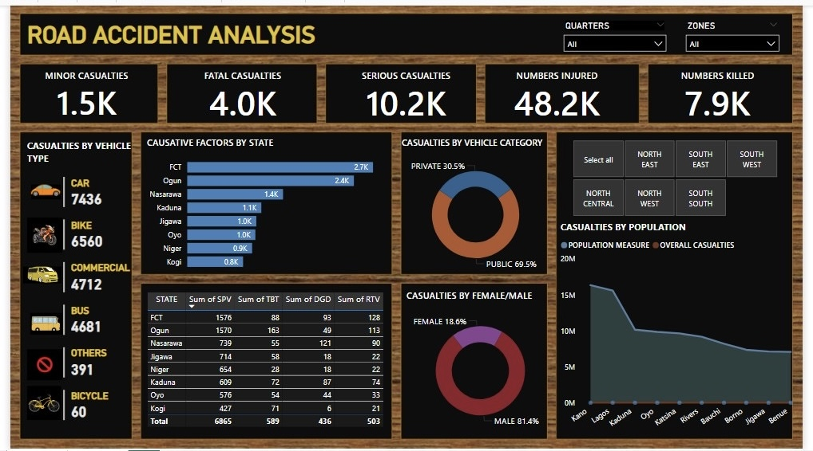

# Road accident analysis 
Using PowerBI, the dataset was analyzed to gain insights determining the number of casualties for each quarters. 
Investigate how different vehicles contribute to this casualties and access whether an increase in population affect the number of road casualties

